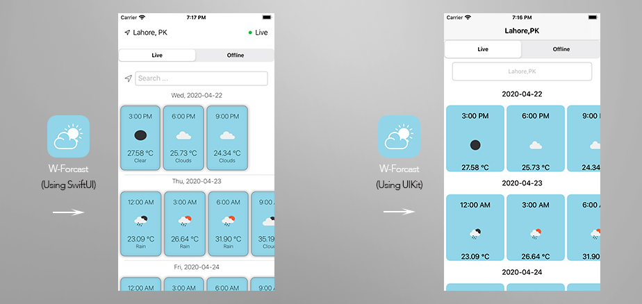
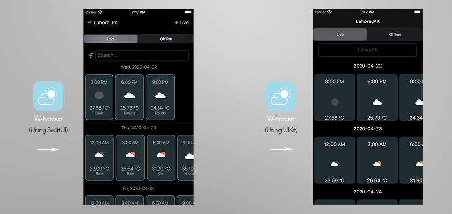

# TheWeatherApp - Using SwiftUI
App Presents information in the view about the temperature, time, date and weather icon in a form of a list, where each row contains all forecasts for a certain day, scrollable of the screen to the right

### Features
- User can search for any city supported by openWeather API and an auto complete list is shown as they search for city and they can fetch wether by tapping on the desired city from the searched list.
- User can switch between live and offline tabs to view either live data or locally stored forcast data from bundled json file.
- While swithcing between tabs last live forcast result is persisted so that user can easily view the last live result by switching the tab and does not have to fetch data again and again.
- When app starts it loads the live forcast for deafult city.
- If there's no internet connectivity at the time of app start and no live forcast for Lahore is fetched. User is shown an error and when internet connectivity is restored app automatically detects the change.
- App supports both landscape and portrait orientations.
- App supports both light and dark mode.
- App supports iOS version 13.x and above. Tested on iPhone 8 with iOS version 13.1.3, and iPhone 11 Pro  simulator.

## Notes
- A cities.json file is bundled with the app, It contains list of all the cities supported by open weather API and is used for auto complete and forcast fetching. Users can only search for the cities in this file and there are over 200,000 cities in the file. 
- cities.json file size is around 20 MB and can be reduced by removing the coordinates for the cities as these are not being used. I used it for fetching the forcast by city id as recommended  in open weather API documentation, becuase of its sheer size the app takes a few seconds to load on first launch when this file is being loaded. This can be fixed by saving this file into coreData or realm offline database  and then making queries through that in auto complete. Other option is to shift to a service like Google places instead of bundling this cities.json file and use name search for city instead  of id search. But to save time I chose to bundle the json file.

## Sample Screens

## Getting Started

These instructions will get you a copy of the project up and running on your local machine for development and debugging purposes.

### Prerequisites

You would need a macbook with XCode 11.x installed. I built the app with XCode 11.2.1

### Installing Builds

- To be able to install the build on the iPhone you will be needing Apple Developer provisioning and certifcate. You can create your Apple developer account [here](https://developer.apple.com/).
- You can create build on iOS 13.x or later simulator provided with the XCode 11.x or later.
- To run the project Navigate to the *TheWeatherApp* folder on your machine where you cloned it. And open the project using *TheWeatherApp.xcodeproj* file.

## User Guide to use the app
- On Launch if app is connected to the internet it automatically fetches forcast for deafult city.
- Default view when app starts is the Live weather mode.
- User can move to offline mode by using the segment control at the top.
- Offline view shows the forcast for Lahore from the json file bundled with in the app.

## Technical Details

### Third Party
- No third party library is used.

### App Architecture
- MVVM Architecture is used in the app.
- Network layer is based on protocol oriented design.

## Built With
- XCode 11.2.1
- Tested on iPhone 8. (iOS 13.1.3)

## Authors

- **Sajjad Haider** - (https://github.com/sajjadhaiderzaidi)

## License

This project is licensed under the MIT License - see the [LICENSE.md](LICENSE.md) file for details
